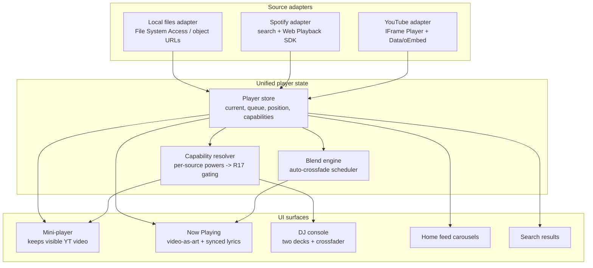

**Target:** `fuse-app/` (full replacement) on a new branch. The rebuild is greenfield inside `fuse-app/`; the existing Vite code there is reference-only and reused nowhere without a stated reason. All paths in this plan are repo-relative to `agent-cmdb-policy-brain/`. SubTrackr file paths cited under "Patterns to follow" are convention references from Vikas's shipped `subscription-tracker` repo, not files in this repo.

## Goal Capsule

- Objective. Rebuild Fuse from zero as a public web music app whose identity is blending — songs melt into each other via auto-crossfade, sourced from YouTube and Spotify plus the user's own files, with a working three-source DJ console, real synced lyrics, playlists, and a learning home feed. Every on-screen control works; nothing decorative pretends to be a feature.
- Authority hierarchy. Vikas (owner) is product authority and personally confirms each phase before the next begins. The approved prototype is the binding design direction. This plan's Product Contract is the source of truth for WHAT; the Planning Contract and Units are the source of truth for HOW.
- Execution profile. `execution: code`. Phased delivery (A-F), each phase an owner-confirmable checkpoint. Every unit is an atomic landable commit gated by `tsc --noEmit && eslint . && test && build`.
- Stop conditions. Stop and surface to Vikas if: an external API constraint flagged UNVERIFIED (YouTube search quota cap, LRCLIB param names) fails live verification and forces a design change; context usage crosses the standing 50% threshold during an autonomous run; or two failed attempts land on the same bug (root-cause at architecture level, do not symptom-patch).
- Tail ownership. The implementing agent owns re-testing neighbors before "done" and ends each phase with a plain-words TEST-IT checklist for Vikas.

---

## Product Contract

Preserved from the requirements-only sibling (`docs/plans/2026-07-17-001-feat-fuse-rebuild-plan.html`), converted to markdown. All R/A/F/AE IDs and decision content are carried verbatim in intent.

### Summary

Build a new Fuse: a public, account-based web music app where listening flows without jarring stops (auto-crossfade as the signature), the heart moment is search -> instant play -> scrolling lyrics, and the DJ console is the pro layer of the same blending idea — honest about what each music source allows.

### Problem Frame

The current Fuse (live on Vercel, code in `fuse-app/`) fails everywhere it matters: playback gets stuck, clicks don't respond, features overlap across screens, and headline buttons — Lyrics, Cue — are pure decoration that show nothing. It presents itself as a YouTube + Spotify player, but only YouTube actually plays, and its real Web Audio DJ engine is bypassed by the very tracks users play. The owner has lost trust in it; polishing is not enough.

### Key Decisions (product)

- Fuse means blend. The product's identity is fusion: automatic crossfades in normal listening, transitions that never jar, and a DJ console that is the manual, pro version of what the app does by itself. Chosen over a plain clean player because it gives Fuse a reason to exist next to Spotify and makes DJ native rather than bolted on.
- Honest capability, everywhere, by design. Every control shown must work for the current situation. When a source cannot do something (for example the full DJ engine on YouTube), the control is visibly disabled with a plain-English reason. This is the class-level fix for the old app's showcase buttons: no feature ships as decoration, ever.
- Three music sources, each with its true powers. YouTube (streams, real thumbnails, huge catalog), Spotify (user's own account, album art, search), and the user's own audio files (the only source whose raw audio the DJ engine can fully process). The app never pretends a source can do more than it can.
- Public app with accounts. Anyone can sign up. Google sign-in, a hosted database for each user's likes, playlists, and settings, deployed on Vercel — the same proven pattern as the owner's SubTrackr app.
- User files never touch our servers. Audio files loaded for DJ mode stay on the user's device (browser-local). We never upload or store anyone's music files — the legal safety line for a public app.
- One v1, built in stages, verified stage by stage. All headline features ship in v1, but the build proceeds in working stages (core playback -> lyrics/playlists -> DJ -> smart feed). Each stage ends with a test-it-yourself checklist the owner confirms before the next begins. Launch can be pulled earlier to a music-only cut if desired.
- The approved prototype is the design north star. Dark premium theme where a warm ember orange and a cool teal always meet in blends; phone-frame app layout with bottom tabs and a persistent mini-player; profile avatar opening full settings; horizontally scrolling home carousels. The built app follows the prototype's look and structure, with real data replacing placeholders.

### Actors

- A1. Listener — any signed-up member of the public. Searches, plays, likes, builds playlists, reads lyrics.
- A2. DJ user — a listener who opens the DJ console and mixes tracks across the three sources.
- A3. Owner (Vikas) — confirms each build stage, reviews as visual pages, and is the product authority.

### Requirements

Core playback & search

- R1. Search returns results from YouTube and Spotify as the user types, each result showing its true cover art (YouTube video thumbnail or Spotify album cover) and a source badge.
- R2. Tapping a result starts playback immediately — the heart moment. Playback never silently sticks; any failure shows a plain-English message and offers a retry or an alternative.
- R3. Songs blend: when one track ends, the next begins with an automatic crossfade whose length the user controls in settings.
- R4. A persistent mini-player (song, play/pause, next) is visible on Home, Search, and Library, and opens the full Now Playing screen when tapped.
- R5. Every track everywhere in the app shows real cover art from its source — never a plain colored box.

Lyrics

- R6. Now Playing shows real lyrics that scroll in time with the song, current line highlighted, fetched from a lyrics service.
- R7. When lyrics don't exist for a track, the screen says so honestly ("No lyrics available for this song") — the feature never fakes or hides.

Library & playlists

- R8. Users can like tracks and see all likes in their Library, saved to their account and present on any device they sign into.
- R9. Users can create, rename, reorder, and delete playlists mixing tracks from any source.

Home feed

- R10. Home shows horizontally scrolling rows (recently played, trending, "more like what you love") with a visible cue that more content sits to the right.
- R11. The "more like what you love" row learns from the user's listening and likes, and visibly improves as they use the app.

DJ console

- R12. The DJ console has two decks and a crossfader; each deck can load a track from My Files, YouTube, or Spotify.
- R13. Decks honestly reflect each source's powers: My Files gets the full engine (EQ, loops, effects, scratch); YouTube gets crossfade and speed with other controls visibly disabled and explained; Spotify can occupy only one deck at a time, with the second deck's Spotify option locked and explained.
- R14. Files loaded for DJ use stay on the user's device and are never uploaded to Fuse's servers; the UI says so where files are loaded.

Accounts & settings

- R15. Anyone can sign up and sign in with Google; each user's likes, playlists, history, and settings are private to their account.
- R16. All settings live under the profile avatar: account & sign out, crossfade length, connected sources (including Spotify connect), lyrics on/off, and about. (Audio-quality control dropped from v1 — see Product Contract preservation and Scope Boundaries.)

Reliability & honesty (the class-level fix)

- R17. No control appears on any screen unless it works in the user's current situation; anything unavailable is visibly disabled with a short plain-English reason.
- R18. The app records its own activity log (playback events, errors) so failures can be diagnosed from evidence, and errors shown to users always say what went wrong and what to do.

### Key Flows

- F1. The heart moment.
  - Trigger: user types in Search.
  - Steps: results appear as they type with real covers -> they tap a song -> it plays within a breath -> they open Now Playing -> lyrics are already scrolling.
  - Covers: R1, R2, R5, R6.
- F2. Blended listening.
  - Trigger: a song approaches its end.
  - Steps: the next queued track melts in over the user's chosen crossfade length; Now Playing visualises the blend.
  - Covers: R3.
- F3. A DJ session.
  - Trigger: user opens the DJ console.
  - Steps: they load Deck A from My Files (full engine lights up), Deck B from YouTube (limited controls, clearly explained), and mix with the crossfader.
  - Covers: R12, R13, R14.
- F4. Joining Fuse.
  - Trigger: a new visitor arrives.
  - Steps: they sign in with Google, optionally connect Spotify in settings, and land on a Home that starts generic and gets personal as they listen.
  - Covers: R10, R11, R15, R16.

### Acceptance Examples

- AE1. When a playing YouTube track stalls (network hiccup), then within a few seconds the player shows "Playback stalled — retrying", retries, and if it still fails offers Skip. It never freezes silently. Covers R2, R18.
- AE2. When the current track has no lyrics on the lyrics service, then Now Playing shows "No lyrics available for this song" instead of an empty or fake panel. Covers R6, R7.
- AE3. When a deck is switched to YouTube, then EQ, loops, effects, and scratch grey out with the note "Not available for YouTube tracks", and crossfade + speed remain live. Covers R13, R17.
- AE4. When Spotify is loaded on Deck A and the user opens Deck B's source picker, then the Spotify option is locked with "Spotify allows one deck at a time". Covers R13, R17.
- AE5. When a user without a connected Spotify Premium account taps a Spotify track, then the app explains and automatically plays the same song's YouTube version, labeled honestly (resolution of Q2; see KTD-2). Covers R17.

### Success Criteria

- From tapping a search result to hearing sound: about three seconds or less on a normal connection.
- Zero decorative controls: a full click-through of every screen finds no button that does nothing.
- Each build stage is confirmed working by the owner on their own screen (test-it-yourself checklist) before the next stage starts; "done" claims always come with fresh evidence.
- The built app is recognisably the approved prototype with real data in it.

### Dependencies & Assumptions (product)

- YouTube's public embedded player provides streaming and thumbnails; its rules mean raw audio is never accessible to the DJ engine (drives R13).
- Spotify sign-in provides search and album art to any user; full-length Spotify playback in the browser requires that user's Spotify Premium (feeds Q2, now resolved in KTD-2).
- A free lyrics service provides synced lyrics; coverage varies by song (drives R7).
- Assumed stack pattern: Google sign-in, hosted database, Vercel deployment — mirroring SubTrackr.
- The existing `fuse-app/` code is reference material only; the rebuild starts clean and reuses nothing without justification.

### Product Contract preservation

- R-IDs changed: none. R1-R18, A1-A3, F1-F4, and AE1-AE5 are preserved with their original identifiers and intent.
- One resolution recorded, no requirement reworded: AE5 in the source deferred the non-Premium Spotify behavior to "Outstanding Question Q2 (once resolved)". Q2 is now resolved to the automatic YouTube-version fallback (KTD-2). AE5's text is updated only to state that resolved outcome; its ID, scope, and R17 coverage are unchanged.
- R16 changed — audio-quality control removed from v1 scope. It would be a decorative control violating R17 (no current source honors a client-set audio-quality selection: YouTube's `setPlaybackQuality` is effectively ignored, Spotify SDK does not expose it, and local files play at their native quality). Moved to Scope Boundaries → Deferred for later. R16's other controls (account & sign out, crossfade length, connected sources, lyrics on/off, about) are unchanged.
- The source's Outstanding Questions (Q1-Q4) are all resolved and moved into Key Technical Decisions (KTD-1..KTD-4). No launch-blocking question remains, so readiness advances to implementation-ready.

---

## Planning Contract

### Key Technical Decisions

- KTD-1. Build in the existing repo, new branch, `fuse-app/` fully replaced. Resolves Q1. A separate dedicated repo is deferred to deploy time. Rationale: keeps the rebuild alongside its reference code and this plan during construction; the public-product repo split is a deploy-time concern, not a build-time one.
- KTD-2. Non-Premium / non-allowlisted Spotify playback auto-plays the matched YouTube version, labeled honestly. Resolves Q2. Rationale: Spotify Web Playback SDK is Premium-only and new apps are dev-mode capped to ~25 allowlisted users (May 2025 policy); `preview_url` is dead for new apps. The YouTube fallback fits the blend identity and keeps the control honest per R17 rather than showing a dead Spotify play button.
- KTD-3. Lyrics come from LRCLIB (`lrclib.net`) — free, keyless, `/api/get` and `/api/search` by track + artist + duration, returning `syncedLyrics` (LRC line-timestamp) and `plainLyrics`. Resolves Q3. Send a descriptive User-Agent; cache results in Postgres. Exact param names are UNVERIFIED — the first unit touching lyrics (U9) verifies the live API before building.
- KTD-4. Trending at launch = a curated seed playlist plus aggregate anonymous play counts once real data accumulates. Resolves Q4. The repos layer records plays from day one (U5/U10) so trending has data to graduate into; before enough data exists, Home shows the curated seed.
- KTD-5. Mirror SubTrackr's proven stack exactly. Next.js 16 App Router + React 19 + TypeScript strict; Tailwind CSS 4; Auth.js (next-auth v5 beta) + Google + `@auth/prisma-adapter` with database session strategy; Prisma 6 + `@prisma/adapter-neon` + `@neondatabase/serverless` (+ `ws` polyfill); Vitest + Playwright; ESLint 9 flat config; `vercel.json` regions `["sin1"]`. Rationale: it is a shipped, working pattern the owner already trusts; deviating without cause reintroduces the old app's risk.
- KTD-6. One unified player state is the single source of playback truth; per-source adapters feed it and per-source renderers consume it. Rationale: the old app's core failure was playback logic that only wired YouTube and let every other source silently no-op. A unified store with an explicit adapter contract makes "which source can do what" a typed, testable seam rather than scattered conditionals (deepens the R17 honesty rule into the architecture).
- KTD-7. The visible-player rule is load-bearing, not cosmetic. YouTube ToS requires the playing video be visible (min 200x200, >50% visible; no hidden/background playback). The Now Playing screen uses the YouTube video itself as the artwork surface, and the mini-player keeps a small visible video whenever a YouTube track plays. Rationale: the old app used a hidden 0x0 player — a ToS violation and a reason embeds can be throttled. This constraint shapes U7's UI, not just its logic.
- KTD-8. Search is quota-defensive by default. YouTube `search.list` costs 100 units against a ~10k/day free budget, and a June-2026 change may cap searches to ~100/day (UNVERIFIED). Server-side cache search results in Postgres keyed by normalized query with a long TTL; debounce the search UI; use `videos.list` (1 unit) and keyless oEmbed for known IDs. Rationale: a naive search-per-keystroke design would exhaust quota in minutes and is the single most likely thing to break the heart moment.
- KTD-9. Security headers must deviate from SubTrackr's DENY-everything CSP. Fuse's CSP must allow YouTube iframe embeds (`frame-src`), `i.ytimg.com` images (`img-src`), and the Spotify Web Playback SDK script/connect (`script-src`, `connect-src`). Rationale: called out explicitly because SubTrackr's posture is deny-all; copying it verbatim would black-hole every player. This is a conscious, minimal relaxation, not a blanket loosening.

### High-Level Technical Design

Player architecture — source adapters feed one unified player state, which drives every UI surface:



DJ capability matrix (drives R13, AE3, AE4, and the capability resolver):

| Capability | My Files (local) | YouTube | Spotify |
|---|---|---|---|
| Load onto a deck | Yes | Yes | One deck at a time only |
| Volume / crossfade | Yes (Web Audio gain) | Yes (iframe volume crossfade) | Yes (via SDK volume, single deck) |
| Playback rate / speed | Yes | Yes (`setPlaybackRate` [0.25..2]) | No (SDK does not expose it) |
| 3-band EQ | Yes | No — greyed, "Not available for YouTube tracks" | No — greyed |
| Loops | Yes | No — greyed | No — greyed |
| FX | Yes | No — greyed | No — greyed |
| Scratch | Yes (decoded buffer) | No — greyed | No — greyed |
| Second simultaneous deck | Yes | Yes | Locked, "Spotify allows one deck at a time" |

Only local files route through the full Web Audio graph (`source -> lowShelf -> midPeak -> highShelf -> deckGain -> crossfadeGain -> master`). YouTube decks are two iframe players mixed by volume crossfade + rate. Spotify occupies at most one deck (Spotify Connect allows one stream at a time).

### Output Structure

New `fuse-app/` after full replacement:

```
fuse-app/
  app/
    layout.tsx                 root layout, theme tokens, fonts
    page.tsx                   home feed
    search/page.tsx
    library/page.tsx
    dj/page.tsx
    now-playing/               (or overlay component mounted in layout)
    api/
      auth/[...nextauth]/route.ts
      search/route.ts          cached YouTube+Spotify search
      lyrics/route.ts          LRCLIB proxy + cache
      spotify/
        connect/route.ts       PKCE start
        callback/route.ts      PKCE exchange
      plays/route.ts           record play events (trending, history)
  components/
    player/                    mini-player, now-playing, video surface
    dj/                        deck, crossfader, capability badges
    home/                      carousels, blend strip
    search/                    searchbar, result row
    library/                   likes list, playlist grid, uploads
    settings/                  profile sheet
    ui/                        primitives (tokens, buttons, sheet)
  lib/
    auth.ts                    Auth.js config (mirror SubTrackr)
    auth-session.ts            requireUser()/getUser() via React cache()
    db.ts                      Prisma client, global caching, Neon adapter
    player/
      store.ts                 unified player state
      adapters/youtube.ts
      adapters/spotify.ts
      adapters/local.ts
      capabilities.ts          capability resolver (R17)
      blend.ts                 auto-crossfade scheduler
    dj/engine.ts               Web Audio engine (local files)
    repos/
      likes.ts
      playlists.ts
      plays.ts                 history + trending aggregates
      lyrics-cache.ts
      search-cache.ts
      settings.ts
    youtube.ts                 Data API + oEmbed helpers
    spotify.ts                 search + PKCE + SDK helpers
    lyrics.ts                  LRCLIB client
    activity-log.ts            R18 event log
  prisma/
    schema.prisma
    seed.ts                    curated trending seed (KTD-4)
  proxy.ts                     route protection (Next 16 middleware rename)
  next.config.ts               CSP allowing YT/Spotify (KTD-9)
  vercel.json                  regions ["sin1"]
  e2e/                         Playwright specs + auth.setup.ts
  vitest.config.ts
  playwright.config.ts
  eslint.config.mjs
  tailwind / globals.css       ported design tokens
  package.json
```

### Environment & secrets

Required env vars, set in Vercel project settings and local `.env.local`, never committed and never written to logs or code (owner standing rule — logs record lengths, never values):

- `AUTH_SECRET` — Auth.js session encryption.
- `GOOGLE_CLIENT_ID`, `GOOGLE_CLIENT_SECRET` — Google OAuth provider.
- `DATABASE_URL` — Neon Postgres connection string.
- `YOUTUBE_API_KEY` — YouTube Data API v3 (search + `videos.list`).
- `SPOTIFY_CLIENT_ID` and `NEXT_PUBLIC_SPOTIFY_CLIENT_ID` — Spotify PKCE (client id is public in PKCE; no client secret needed).
- `NEXT_PUBLIC_BASE_URL` — public origin for OAuth/PKCE redirect URIs.

`.env.local` and any secret file stay in `.gitignore`. Spotify allowlist (dev-mode ~25 users) is managed in the Spotify developer dashboard, not in code.

### Assumptions & constraints

- LRCLIB param names (KTD-3) and the YouTube ~100/day search cap (KTD-8) are UNVERIFIED; U9 and U6 respectively verify live before building on them and record findings inline.
- Local audio files never leave the device (R14); no upload endpoint exists for user media by design.
- Modern-browser autoplay requires a muted start or a prior user gesture; the first play is always user-initiated (a tap), and blend transitions inherit that gesture context.

### Sequencing

Phases are strictly ordered; each ends at an owner checkpoint (see Verification Contract). Units within a phase may be built in listed order.

- Phase A — Foundation: U1, U2, U3, U4.
- Phase B — Core listening: U5, U6, U7, U8.
- Phase C — Lyrics + likes + playlists: U9, U10.
- Phase D — Blend engine + home feed: U11, U12.
- Phase E — DJ console: U13, U14.
- Phase F — Hardening: U15, U16.

---

## Implementation Units

### Unit Index

| U-ID | Title | Primary files | Depends on |
|---|---|---|---|
| U1 | Scaffold + tooling + CI gate | `fuse-app/package.json`, configs, `app/layout.tsx` | — |
| U2 | Google auth + session + route protection | `lib/auth.ts`, `lib/auth-session.ts`, `proxy.ts` | U1 |
| U3 | Prisma + Neon + repos skeleton | `prisma/schema.prisma`, `lib/db.ts`, `lib/repos/*` | U1 |
| U4 | App shell + theme tokens + tabs + mini-player scaffold | `app/layout.tsx`, `components/ui/*`, `globals.css` | U1, U2 |
| U5 | Unified player state + adapter contract | `lib/player/store.ts`, `lib/player/adapters/*`, `lib/player/capabilities.ts` | U4 |
| U6 | Search with server-side caching | `app/api/search/route.ts`, `lib/repos/search-cache.ts`, `components/search/*` | U3, U5 |
| U7 | YouTube playback + visible-player rule | `lib/player/adapters/youtube.ts`, `components/player/*` | U5 |
| U8 | Now Playing screen + error/retry paths | `components/player/now-playing.tsx`, `lib/activity-log.ts` | U7 |
| U9 | Synced lyrics (LRCLIB) + honest empty state | `app/api/lyrics/route.ts`, `lib/lyrics.ts`, `lib/repos/lyrics-cache.ts` | U8 |
| U10 | Likes + playlists + Library | `lib/repos/likes.ts`, `lib/repos/playlists.ts`, `components/library/*` | U3, U5 |
| U11 | Auto-crossfade blend engine | `lib/player/blend.ts`, `components/player/melt-panel.tsx` | U7 |
| U12 | Home feed + trending + recommendations | `app/page.tsx`, `lib/repos/plays.ts`, `components/home/*` | U10, U11 |
| U13 | DJ console + capability matrix + source locks | `app/dj/page.tsx`, `components/dj/*`, `lib/player/capabilities.ts` | U5, U7 |
| U14 | Web Audio engine for local files | `lib/dj/engine.ts`, `lib/player/adapters/local.ts` | U13 |
| U15 | Spotify connect + SDK + YouTube fallback | `app/api/spotify/*`, `lib/spotify.ts`, `lib/player/adapters/spotify.ts` | U6, U7 |
| U16 | Hardening: activity log, a11y, e2e | `lib/activity-log.ts`, `e2e/*`, `components/**` | all |

Patterns to follow references cite files in the SubTrackr (`subscription-tracker`) repo as conventions, not files in this repo.

---

### Phase A — Foundation

### U1. Scaffold Next.js 16 app, tooling, and CI gate

- Goal. Replace `fuse-app/` with a clean Next.js 16 App Router + React 19 + TypeScript strict + Tailwind CSS 4 project that builds green, with Vitest, Playwright, and ESLint 9 wired and a CI gate.
- Requirements. KTD-1, KTD-5. Foundation for all R-IDs.
- Dependencies. None.
- Files. `fuse-app/package.json`, `fuse-app/tsconfig.json`, `fuse-app/next.config.ts`, `fuse-app/vercel.json`, `fuse-app/vitest.config.ts`, `fuse-app/playwright.config.ts`, `fuse-app/eslint.config.mjs`, `fuse-app/app/layout.tsx`, `fuse-app/app/page.tsx` (placeholder), `fuse-app/globals.css`, `.github/workflows` CI entry.
- Approach. Remove the old Vite tree under `fuse-app/`. Initialize App Router with strict TS and Tailwind 4. Set `vercel.json` regions `["sin1"]`. Add the CI gate `tsc --noEmit && eslint . && vitest run && next build` (matches the Verification Contract; `playwright test` joins from U16). Draft CSP in `next.config.ts` per KTD-9 (allow YouTube `frame-src`/`img-src i.ytimg.com`, Spotify SDK `script-src`/`connect-src`); leave a code comment marking it as the deliberate deviation from SubTrackr's deny-all.
- Patterns to follow. SubTrackr `next.config.ts` (security headers), `vercel.json` (regions), `vitest.config.ts`, `playwright.config.ts`, `eslint.config.mjs`.
- Test scenarios.
  - Input: fresh checkout. Action: run the CI gate command. Expected: `tsc --noEmit`, `eslint .`, `vitest run`, and `next build` all exit 0 on the empty scaffold.
  - Input: `next.config.ts`. Action: inspect response headers on a built page. Expected: CSP present and allows `https://www.youtube.com` frames and `i.ytimg.com` images.
- Verification. CI gate green; app boots to the placeholder page locally.

### U2. Google sign-in, database sessions, route protection

- Goal. Any visitor can sign in with Google; sessions are database-backed; app routes are protected in `proxy.ts`; a central `requireUser()`/`getUser()` exists.
- Requirements. R15; supports R8, R9, R16.
- Dependencies. U1.
- Files. `fuse-app/lib/auth.ts`, `fuse-app/lib/auth-session.ts`, `fuse-app/app/api/auth/[...nextauth]/route.ts`, `fuse-app/proxy.ts`.
- Approach. Auth.js (next-auth v5 beta) + Google provider + `@auth/prisma-adapter`, database session strategy. `lib/auth-session.ts` exposes `requireUser()` (redirect if unauthenticated) and `getUser()` memoized via React `cache()`. `proxy.ts` (Next 16 rename of middleware) protects app routes and redirects unauthenticated users to sign-in.
- Patterns to follow. SubTrackr `auth.ts`, `lib/auth-session.ts`, `app/api/auth/[...nextauth]/route.ts`, `proxy.ts`, `e2e/auth.setup.ts`.
- Test scenarios.
  - Input: unauthenticated request to a protected route. Action: GET the route. Expected: redirect to sign-in, not a 200 render.
  - Input: authenticated session. Action: call `requireUser()`. Expected: returns the user; a second call in the same request does not re-query (cache()).
- Verification. Sign-in flow completes end-to-end in a local run against a test Google client; protected route blocks when signed out.

### U3. Prisma schema, Neon client, repos skeleton with tenant isolation

- Goal. A hosted Postgres schema and a repos layer where every owned-data query is keyed by `ownerId`, ready for likes, playlists, history, settings, and caches.
- Requirements. R8, R9, R11, R15, R16, R18; KTD-4, KTD-8.
- Dependencies. U1.
- Files. `fuse-app/prisma/schema.prisma`, `fuse-app/lib/db.ts`, `fuse-app/lib/repos/likes.ts`, `fuse-app/lib/repos/playlists.ts`, `fuse-app/lib/repos/plays.ts`, `fuse-app/lib/repos/settings.ts`, `fuse-app/lib/repos/search-cache.ts`, `fuse-app/lib/repos/lyrics-cache.ts`, `fuse-app/prisma/seed.ts`.
- Approach. Prisma 6 + `@prisma/adapter-neon` + `@neondatabase/serverless` with `ws` polyfill; single client in `lib/db.ts` with global caching. Schema: `User` (from Auth.js adapter), `Like`, `Playlist`, `PlaylistTrack` (ordered), `Play` (history + trending aggregate source), `Setting`, `SearchCache` (normalized query key + TTL), `LyricsCache` (track key). Track identity stored source-agnostically (source + nativeId + title + artist + artUrl). Every repo function that touches owned data filters and mutates by `{ id, ownerId }` (`updateMany`/`deleteMany` keyed on both). `seed.ts` writes the curated trending seed (KTD-4).
- Patterns to follow. SubTrackr `lib/db.ts`, `lib/repos/subscriptions.ts` and `lib/repos/*.test.ts` (ownerId isolation, `updateMany`/`deleteMany` keyed shape), `prisma/seed.ts`.
- Test scenarios.
  - Covers R15/R8 isolation. Input: two users, user A likes a track. Action: user B lists likes. Expected: B sees nothing of A's; cross-tenant read returns empty.
  - Input: user A tries to delete user B's playlist by id. Action: call the delete repo. Expected: zero rows affected (keyed `{id, ownerId}`), B's playlist intact.
  - Input: same normalized query cached with unexpired TTL. Action: read search cache. Expected: cache hit returned without an external call path.
- Verification. Repo unit tests green; a migration applies cleanly to a Neon test database; seed populates trending rows.

### U4. App shell, theme tokens, bottom tabs, mini-player scaffold

- Goal. The prototype's look and structure in real components: dark ember/teal duotone theme, phone-frame-like responsive layout, bottom tab bar (Home, Search, DJ, Library), persistent mini-player scaffold, and the profile sheet shell.
- Requirements. R4, R16; design fidelity direction.
- Dependencies. U1, U2.
- Files. `fuse-app/app/layout.tsx`, `fuse-app/globals.css`, `fuse-app/components/ui/*`, `fuse-app/components/player/mini-player.tsx` (scaffold), `fuse-app/components/settings/profile-sheet.tsx` (scaffold).
- Approach. Port the prototype's CSS language into Tailwind 4 tokens: ink neutrals (`--ink-0..3`), the ember (`#ff7a4d`) and teal (`#34e4c6`) hues, the `--fuse` gradient that always appears where the two meet, radii, display/body/mono font stacks. Build the tab bar, the dock (mini-player + tabs) with the fuse gradient on the active tab label, and the profile sheet that slides up from the avatar. Mini-player is a scaffold (no real playback yet) visible on Home, Search, Library. Honor `prefers-reduced-motion`.
- Patterns to follow. Prototype `fuse-prototype.html` (tokens, `.dock`, `.tabbar`, `.mini`, `.sheet`, `.avatar`). SubTrackr layout/theme conventions for App Router structure.
- Test scenarios.
  - Input: viewport at mobile and desktop widths. Action: render layout. Expected: phone-frame-like layout, no horizontal body scroll, tabs fixed at bottom.
  - Input: tap the profile avatar. Action: open. Expected: settings sheet slides up with Account, Playback (crossfade length), Sources, Lyrics (on/off), About groups present — no audio-quality control (dropped from v1 per R16); functional controls wired in their owning units (crossfade slider in U11, lyrics toggle in U9, Sources in U15).
  - Input: `prefers-reduced-motion: reduce`. Action: render. Expected: transitions collapse to near-instant.
- Verification. Owner recognises the prototype look; tabs switch screens; mini-player and profile sheet render on all three tabbed screens.

---

### Phase B — Core listening

### U5. Unified player state and source-adapter contract

- Goal. One player store is the single source of playback truth; a typed adapter contract exposes each source's capabilities so gating (R17) is computed, not scattered.
- Requirements. R2, R3, R4, R17; KTD-6.
- Dependencies. U4.
- Files. `fuse-app/lib/player/store.ts`, `fuse-app/lib/player/adapters/index.ts`, `fuse-app/lib/player/capabilities.ts`, `fuse-app/lib/player/types.ts`.
- Approach. Define `PlayerState` (current, queue, isPlaying, positionSec, durationSec, shuffle, repeat) and a `SourceAdapter` contract with an explicit `play`/`pause`/`seek`/`setVolume`/`setRate` surface plus a `capabilities` descriptor per source. `capabilities.ts` resolves the DJ/player capability matrix from source + context (which deck, whether Spotify already occupies a deck, whether the user is Premium/allowlisted). The store is the only place playback truth lives; UI subscribes. This is the class-level fix for the old app's YouTube-only wiring.
- Patterns to follow. Prototype source badges (`.src.yt/.sp/.mp3`) for the display contract. SubTrackr repos-layer discipline (one seam, typed) as the structural analogue.
- Test scenarios.
  - Covers AE3 groundwork. Input: capability resolver called with source=youtube on a deck. Action: resolve. Expected: EQ/loops/FX/scratch = off with reason "Not available for YouTube tracks"; crossfade + rate = on.
  - Covers AE4 groundwork. Input: Spotify already on Deck A, resolve Deck B Spotify option. Action: resolve. Expected: locked with reason "Spotify allows one deck at a time".
  - Input: play a track then pause. Action: dispatch through store. Expected: `isPlaying` reflects state; no source-specific branch leaks into the store's public API.
- Verification. Store and capability-resolver unit tests green; capability outputs match the DJ capability matrix table exactly.

### U6. Search with server-side caching (YouTube + Spotify)

- Goal. As-you-type search returns YouTube and Spotify results with real cover art and source badges, without exhausting YouTube quota.
- Requirements. R1, R5; KTD-8.
- Dependencies. U3, U5.
- Files. `fuse-app/app/api/search/route.ts`, `fuse-app/lib/youtube.ts`, `fuse-app/lib/spotify.ts` (search only), `fuse-app/lib/repos/search-cache.ts`, `fuse-app/components/search/searchbar.tsx`, `fuse-app/components/search/result-row.tsx`.
- Approach. First: verify the current YouTube search quota reality (KTD-8 UNVERIFIED ~100/day cap) live and record the finding inline in the route file. Server route normalizes the query, checks `SearchCache` (long TTL), and only on a miss calls YouTube `search.list` (100 units) and Spotify search (app credentials, works for all users). Debounce the input client-side. Prefer `videos.list` (1 unit) and keyless oEmbed for known IDs. YouTube thumbnails from `i.ytimg.com/vi/{id}/hqdefault.jpg` with a fallback chain from `maxresdefault`. Spotify supplies album covers for all users via app credentials. Interim honesty (R17): the Spotify playback adapter and YouTube fallback land in U15 (Phase F); until then Spotify search results render with a disabled state and the reason "Plays after Spotify support arrives" — never a clickable dead result. YouTube results are fully playable from U7.
- Patterns to follow. Prototype `.searchbar`, `.sresult`, `.src` badges. SubTrackr API route + repo pattern for cached reads.
- Test scenarios.
  - Input: query "paper cities" typed quickly. Action: search. Expected: single debounced request; results show YouTube and Spotify items each with real art and a source badge.
  - Input: same query within TTL. Action: search again. Expected: served from `SearchCache`, no external YouTube `search.list` call.
  - Input: a known video id. Action: resolve title/thumbnail. Expected: uses `videos.list`/oEmbed (1 unit / keyless), not `search.list`.
- Verification. Search renders real covers; cache hit avoids quota spend (assert via log/counter); quota-reality finding recorded in the route.

### U7. YouTube playback with the visible-player rule

- Goal. Tapping a YouTube result plays immediately, with the video visible as the artwork surface on Now Playing and a small visible video in the mini-player — never hidden.
- Requirements. R2, R4, R5; KTD-7.
- Dependencies. U5.
- Files. `fuse-app/lib/player/adapters/youtube.ts`, `fuse-app/components/player/video-surface.tsx`, `fuse-app/components/player/mini-player.tsx`.
- Approach. YouTube IFrame Player API adapter feeding the U5 store. The player is always a visible element (min 200x200, >50% visible) — on Now Playing the video is the art; in the mini-player a small visible video shows while a YouTube track plays. First play is user-gesture-initiated; autoplay for later tracks starts muted or inherits the gesture. `setPlaybackRate` clamped to [0.25..2]. One player autoplays at a time. Position/duration polled from the player into the store.
- Patterns to follow. Prototype `.np-art` and `.mini .art` as the surfaces the video occupies. Old `fuse-app` `createYouTubePlayer` as an anti-pattern reference (it used a hidden 0x0 player — do not repeat).
- Test scenarios.
  - Input: tap a YouTube search result. Action: play. Expected: audio starts within ~3s and the video is visible as Now Playing art.
  - Input: a YouTube track playing, collapse to mini-player. Action: observe. Expected: a small visible video remains in the mini-player (no hidden playback).
  - Input: set speed to 3x. Action: apply. Expected: clamped to 2x.
- Verification. Playback works on a real run; the playing video is visibly on-screen at both Now Playing and mini-player scales.

### U8. Now Playing screen and error/retry paths

- Goal. The full Now Playing screen (art surface, scrub bar, transport, source badge) with honest failure handling — stalls retry visibly, then offer Skip; nothing freezes silently.
- Requirements. R2, R4, R18; AE1.
- Dependencies. U7.
- Files. `fuse-app/components/player/now-playing.tsx`, `fuse-app/components/player/scrub.tsx`, `fuse-app/lib/activity-log.ts` (initial).
- Approach. Build Now Playing from the store: title/artist, source badge, scrub with current/duration, transport (prev/play-pause/next, shuffle/repeat). Wrap playback in a state machine that detects stalls (no progress within a timeout) and buffering; on stall show "Playback stalled — retrying", retry, and after repeated failure surface Skip. Record playback events and errors to the activity log (R18 seed here, completed in U16). Every user-facing error states what went wrong and what to do.
- Patterns to follow. Prototype `.np`, `.np-art`, `.scrub`, `.transport`.
- Test scenarios.
  - Covers AE1. Input: simulate a YouTube stall (no progress). Action: keep playing. Expected: "Playback stalled — retrying" appears within a few seconds, a retry fires, and after continued failure a Skip control is offered; never a silent freeze.
  - Input: any playback error. Action: inspect the activity log. Expected: an event recorded with cause (values only as lengths for anything sensitive; no secrets).
  - Input: tap next. Action: advance. Expected: mini-player and Now Playing both reflect the new track.
- Verification. Stall path demonstrated on a real run; activity log captures the event; owner Phase B checklist passes.

---

### Phase C — Lyrics, likes, playlists

### U9. Synced lyrics from LRCLIB with honest empty state

- Goal. Now Playing shows real time-synced lyrics scrolling with the song, current line highlighted; when none exist, it says so plainly. Also wires the profile-sheet Lyrics on/off toggle (write-side): the control persists to the `Setting` repo and this unit consumes it to show/hide the lyrics panel.
- Requirements. R6, R7, R16 (lyrics on/off control); AE2; KTD-3.
- Dependencies. U8.
- Files. `fuse-app/app/api/lyrics/route.ts`, `fuse-app/lib/lyrics.ts`, `fuse-app/lib/repos/lyrics-cache.ts`, `fuse-app/lib/repos/settings.ts` (lyrics on/off read/write), `fuse-app/components/player/lyrics.tsx`, `fuse-app/components/settings/profile-sheet.tsx` (Lyrics toggle wiring).
- Approach. First: verify LRCLIB's live API (`/api/get`, `/api/search`) exact parameter names and response shape (KTD-3 UNVERIFIED) and record the finding inline in `lib/lyrics.ts`. Server route queries LRCLIB by track + artist + duration with a descriptive User-Agent, parses `syncedLyrics` (LRC line timestamps) into timed lines, and caches in `LyricsCache`. The lyrics component scrolls lines against player position, highlighting the active line with the fuse gradient. When LRCLIB returns nothing, render "No lyrics available for this song" — never an empty or faked panel. Respect the lyrics on/off setting.
- Patterns to follow. Prototype `.lyrics`, `.lyric.active` (fuse gradient text), `.lyrics-off`. SubTrackr cached-read repo pattern.
- Test scenarios.
  - Covers AE2. Input: a track LRCLIB has no lyrics for. Action: open Now Playing. Expected: "No lyrics available for this song"; no empty/fake panel.
  - Input: a track with synced lyrics. Action: play. Expected: lines scroll in time, the current line is highlighted, and it stays roughly in sync as position advances.
  - Input: same track again within TTL. Action: open. Expected: served from `LyricsCache`, no repeat LRCLIB call.
  - Input: toggle Lyrics off in the profile sheet, reopen Now Playing. Action: set and read back. Expected: the setting persists to the `Setting` repo and the lyrics panel is hidden; toggling on restores it — the control does something real (R16/R17).
- Verification. Live LRCLIB param finding recorded; synced scroll demonstrated on a real track; empty state honest; lyrics on/off toggle persists and is honored. Test file: `fuse-app/lib/lyrics.test.ts`.

### U10. Likes, playlists, and the Library screen

- Goal. Users can like tracks and see them in Library across devices; create, rename, reorder, and delete playlists mixing any source; uploads pane states files stay on-device.
- Requirements. R8, R9, R14 (upload copy).
- Dependencies. U3, U5.
- Files. `fuse-app/lib/repos/likes.ts`, `fuse-app/lib/repos/playlists.ts`, `fuse-app/components/library/*`, `fuse-app/app/library/page.tsx`.
- Approach. Likes and playlists through the repos layer with `ownerId` isolation (reorder persists `PlaylistTrack` order). Library screen has Liked / Playlists / Uploads tabs per the prototype. The Uploads pane shows the on-device notice (R14) — no upload endpoint exists; local files are session-scoped object URLs surfaced here for DJ use.
- Patterns to follow. Prototype `.lib-tabs`, `.pl-grid`, `.uploads` (on-device notice). SubTrackr `lib/repos/subscriptions.ts` for owned-CRUD shape.
- Test scenarios.
  - Input: like a track, sign out, sign in on another session. Action: open Library. Expected: the like is present (account-scoped, cross-device).
  - Input: create a playlist, add tracks from YouTube and Spotify, reorder, rename, delete. Action: each op. Expected: all persist and reflect immediately; order survives reload.
  - Input: open Uploads. Action: view. Expected: "These files stay on your device — used for DJ mode, never uploaded" is shown; no network upload occurs.
- Verification. Repo tests green; owner can build a mixed-source playlist. Test files: `fuse-app/lib/repos/likes.test.ts`, `fuse-app/lib/repos/playlists.test.ts`.

---

### Phase D — Blend engine and home feed

### U11. Auto-crossfade blend engine

- Goal. When a track nears its end, the next melts in over the user's chosen crossfade length; Now Playing visualises the blend. Also wires the profile-sheet crossfade-length slider (write-side): the control persists to the `Setting` repo and the blend engine reads it.
- Requirements. R3, R16 (crossfade-length control); F2; KTD-6.
- Dependencies. U7.
- Files. `fuse-app/lib/player/blend.ts`, `fuse-app/lib/repos/settings.ts` (crossfade length read/write), `fuse-app/components/player/melt-panel.tsx`, `fuse-app/components/settings/profile-sheet.tsx` (crossfade slider wiring).
- Approach. A scheduler in the player core watches position and, at (duration - crossfade), starts the next queued track and ramps a volume crossfade between the two. For YouTube, two iframe players volume-crossfade (equal-power curve). Crossfade length comes from the user setting (3-15s). The melt panel shows the incoming track and a progress bar. Autoplay of the incoming track starts muted then ramps up, satisfying autoplay policy without a new gesture.
- Patterns to follow. Prototype `.melt-panel`, `.melt-bar`, the "Auto-crossfade on" home hint. Old `DJEngine` equal-power crossfade curve `cos((p*PI)/2)` as the curve reference.
- Test scenarios.
  - Input: two-track queue, crossfade set to 8s. Action: let track one reach its tail. Expected: track two begins ~8s before track one ends and the two overlap; no cut to silence.
  - Input: change crossfade to 3s via the profile-sheet slider. Action: set, reload, then trigger the next transition. Expected: the value persists to the `Setting` repo across reload and the overlap window is ~3s — the slider does something real (R16/R17).
  - Input: transition in progress. Action: view Now Playing. Expected: melt panel shows the incoming track and its progress.
- Verification. Blended transition demonstrated on a real run at two different crossfade lengths.

### U12. Home feed — carousels, trending, recommendations

- Goal. Home shows horizontally scrolling rows (recently played, trending, "more like what you love") with a visible right-scroll cue; recommendations improve with use.
- Requirements. R10, R11; F4; KTD-4.
- Dependencies. U10, U11.
- Files. `fuse-app/app/page.tsx`, `fuse-app/lib/repos/plays.ts`, `fuse-app/app/api/plays/route.ts`, `fuse-app/components/home/*`.
- Approach. Recently played from the user's `Play` history. Trending = curated seed (KTD-4) until aggregate anonymous play counts have enough data, then graduate to counts. "More like what you love" derives from the user's likes and play history (simple content affinity by artist/source/co-play), visibly refreshing as data grows. Carousels use the prototype's rail with the fade + chevron scroll affordance. Play events recorded via `lib/repos/plays.ts` from the player.
- Patterns to follow. Prototype `.rail-wrap`, `.rail-fade`, `.rail-chev`, `.blend-strip`.
- Test scenarios.
  - Input: a new account with no history. Action: open Home. Expected: trending shows the curated seed; "more like what you love" shows a sensible generic set (not empty).
  - Input: play and like several tracks by one artist. Action: reopen Home. Expected: "more like what you love" visibly shifts toward related items.
  - Input: a carousel with overflow. Action: view. Expected: a right-edge fade/chevron cue indicates more content; scrolling reveals it.
- Verification. Owner sees a Home that starts generic and personalises; trending populated. Owner Phase D checklist passes.

---

### Phase E — DJ console

### U13. DJ console — two decks, crossfader, capability matrix, source locks

- Goal. The DJ console with two decks and a crossfader, each deck loadable from My Files / YouTube / Spotify, with controls that honestly reflect each source's powers.
- Requirements. R12, R13, R17; AE3, AE4; F3.
- Dependencies. U5, U7.
- Files. `fuse-app/app/dj/page.tsx`, `fuse-app/components/dj/deck.tsx`, `fuse-app/components/dj/crossfader.tsx`, `fuse-app/components/dj/capability-badges.tsx`, `fuse-app/lib/player/capabilities.ts`.
- Approach. Two decks (A ember, B teal) and a crossfader per the prototype. Each deck's source picker and control set are driven by the U5 capability resolver: YouTube decks grey out EQ/loops/FX/scratch with the reason, keeping crossfade + speed; when Spotify occupies one deck, the other deck's Spotify option locks with its reason. The honesty note ("Every control here does something real…") is shown. YouTube decks are two iframe players volume-crossfaded. The local-files engine lands in U14; until then the My Files deck source option renders disabled with the plain-English reason "Full DJ engine arrives with local-file support" — no landable U13 commit exposes an enabled-but-dead My Files deck or its EQ/loops/FX/scratch controls (R17). U14 flips My Files live.
- Patterns to follow. Prototype `.deck`, `.source-pick`, `.spick.locked`, `.cap.on/.cap.off`, `.cap-hint`, `.xfader`.
- Test scenarios.
  - Covers AE3. Input: switch a deck to YouTube. Action: observe controls. Expected: EQ, loops, FX, scratch grey out with "Not available for YouTube tracks"; crossfade + speed stay live.
  - Covers AE4. Input: load Spotify on Deck A, open Deck B's source picker. Action: observe. Expected: Deck B's Spotify option is locked with "Spotify allows one deck at a time".
  - Input: two YouTube decks loaded, move the crossfader. Action: drag. Expected: audio blends between decks by volume; readout reflects the mix.
  - Input: open a deck's source picker before U14 lands. Action: observe the My Files option. Expected: My Files is disabled with the reason "Full DJ engine arrives with local-file support"; it cannot be selected and no dead EQ/loops/FX/scratch controls appear (R17).
- Verification. Capability gating matches the matrix table; owner sees no fake knob; My Files deck is honestly disabled until U14. Test file: `fuse-app/components/dj/capabilities.test.ts`.

### U14. Web Audio engine for local files

- Goal. My Files decks get the full engine — EQ, loops, effects, scratch — running on real decoded audio that never leaves the device.
- Requirements. R12, R13, R14.
- Dependencies. U13.
- Files. `fuse-app/lib/dj/engine.ts`, `fuse-app/lib/player/adapters/local.ts`.
- Approach. Load local audio via the File System Access API / object URLs and `decodeAudioData` (never uploaded — R14). Build the audio graph `source -> lowShelf -> midPeak -> highShelf -> deckGain -> crossfadeGain -> master` so 3-band EQ, per-deck gain, and the crossfader affect real sound; add loops, FX, and scratch on the decoded buffer. Resume the AudioContext on a user gesture. Local decks route through this engine; YouTube/Spotify decks do not (matrix).
- Patterns to follow. Old `fuse-app` `DJEngine.ts` graph and `loadFile`/`setEq`/`setCrossfade`/`resume` as a working reference (the one part of the old app that genuinely worked) — reuse the approach, not the code, without justification.
- Test scenarios.
  - Input: load a local audio file onto Deck A. Action: play and turn the Low EQ. Expected: audible low-frequency change; file never sent over the network.
  - Input: move the crossfader between two local decks. Action: drag. Expected: equal-power crossfade audibly blends the two.
  - Input: engage a loop. Action: set loop points. Expected: the section repeats seamlessly.
  - Input: open a deck's source picker after U14 lands. Action: observe the My Files option. Expected: My Files is now enabled (no longer disabled with the "engine arrives" reason), selectable, and loading a file lights up the full EQ/loops/FX/scratch engine live.
- Verification. Full engine demonstrated on real local files; My Files deck source flips from disabled (U13) to live; network panel shows no upload of user media. Owner Phase E checklist passes.

---

### Phase F — Hardening

### U15. Spotify connect (PKCE), Web Playback SDK, and YouTube fallback

- Goal. Users can connect Spotify for search/metadata everywhere; allowlisted Premium users get real Spotify playback via the SDK; everyone else automatically hears the YouTube version, labeled honestly.
- Requirements. R16, R17; AE5; KTD-2.
- Dependencies. U6, U7.
- Files. `fuse-app/app/api/spotify/connect/route.ts`, `fuse-app/app/api/spotify/callback/route.ts`, `fuse-app/lib/spotify.ts`, `fuse-app/lib/player/adapters/spotify.ts`, `fuse-app/components/settings/profile-sheet.tsx` (Sources).
- Approach. Authorization Code + PKCE connect from the profile Sources section. Search/metadata/covers already work for all users via app credentials (U6). For playback: if the user is allowlisted + Premium, use the Web Playback SDK (assume one Spotify stream at a time — the one-deck rule R13). Otherwise, when a Spotify track is tapped, explain and automatically play the same song's matched YouTube version (KTD-2), with an honest label. The capability resolver already encodes the one-deck and Premium constraints.
- Patterns to follow. Old `fuse-app` `spotify.ts` PKCE scaffold (auth + search wired) as a reference for the connect flow. Prototype Sources rows (`.connect-btn`, `.connected-tag`).
- Test scenarios.
  - Covers AE5. Input: a user with no connected Spotify Premium taps a Spotify track. Action: play. Expected: a plain explanation, then the matched YouTube version plays automatically with an honest label; no dead Spotify button.
  - Input: an allowlisted Premium user connects Spotify and plays a Spotify track. Action: play. Expected: real Spotify playback via the SDK.
  - Input: Spotify connected. Action: open Sources in the profile sheet. Expected: shows Connected; disconnect available.
- Verification. Fallback demonstrated for a non-Premium user; connect flow completes; honest labeling present.

### U16. Hardening — activity log, error paths, accessibility, Playwright e2e

- Goal. Complete the activity log, cover the reliability error paths end-to-end, meet accessibility basics, and lock behavior with Playwright e2e across the heart moment and honesty rules.
- Requirements. R2, R17, R18; AE1-AE5; Success Criteria.
- Dependencies. all prior units.
- Files. `fuse-app/lib/activity-log.ts`, `fuse-app/e2e/*.spec.ts`, `fuse-app/e2e/auth.setup.ts`, touch-ups across `fuse-app/components/**`.
- Approach. Finish the activity log (playback events + errors; lengths not values for anything sensitive — no secrets to disk/logs). Audit every screen for R17 (no control that does nothing; unavailable controls disabled with a reason). Accessibility: focus-visible rings, ARIA labels on transport/tabs/sheet, `prefers-reduced-motion`, keyboard operability. Playwright e2e with auth storage state covering: the heart moment (search -> instant play -> lyrics), the stall/retry path, the two DJ honesty locks, and the Spotify fallback.
- Patterns to follow. SubTrackr `e2e/auth.setup.ts` and Playwright config (auth storage state, dev server).
- Test scenarios.
  - Covers AE1. e2e: force a stall -> assert "retrying" then Skip.
  - Covers AE2. e2e: a no-lyrics track -> assert the honest message.
  - Covers AE3. e2e: YouTube deck -> assert EQ/loops/FX/scratch disabled with reason.
  - Covers AE4. e2e: Spotify on Deck A -> assert Deck B Spotify locked with reason.
  - Covers AE5. e2e: non-Premium taps Spotify track -> assert YouTube version plays, labeled.
  - Input: full click-through of every screen. Action: e2e sweep. Expected: no control does nothing (zero decorative controls).
- Verification. Full Playwright suite green; a11y checks pass; owner Phase F checklist passes; activity log captures events without secrets.

---

## Verification Contract

CI gate (every unit; blocks merge):

| Command | Purpose |
|---|---|
| `tsc --noEmit` | Type safety, strict mode |
| `vitest run` | Colocated `*.test.ts` unit tests (node env) |
| `next build` | Production build succeeds |
| `playwright test` | e2e (from U16; heart moment + honesty rules) |
| `eslint .` | Lint (ESLint 9 flat config) |

Per-phase owner-confirmable checkpoints (Vikas personally tests each on his own screen before the next phase begins — plain words, no jargon):

- After Phase A. "You can sign in with Google, you land on the Fuse app that looks like the prototype (dark, ember + teal, bottom tabs, mini-player, profile sheet), and tapping your avatar opens settings. Nothing plays yet."
- After Phase B. "You can search, see real covers from YouTube and Spotify, tap a song and hear it within about three seconds with the video showing, open Now Playing, and if playback stalls it says so and lets you skip — it never freezes."
- After Phase C. "Lyrics scroll in time on songs that have them and say 'no lyrics' honestly when they don't; you can like songs and build playlists that mix sources, and your likes follow you when you sign in again."
- After Phase D. "Songs melt into each other with your chosen crossfade length, and Home has scrolling rows that start generic and get more personal as you listen."
- After Phase E. "The DJ console has two decks and a crossfader; your own files get the full gear, YouTube greys out what it can't do and says why, and Spotify locks the second deck with a reason — no fake knobs."
- After Phase F. "Every button on every screen does something real, errors always tell you what happened and what to do, connecting Spotify works, and if you're not a Premium user a Spotify song plays its YouTube version and says so."

---

## Definition of Done

Global:

- Every requirement R1-R18 is implemented and traced to at least one unit; every AE1-AE5 has a passing e2e test.
- CI gate green: `tsc --noEmit && vitest run && next build && playwright test && eslint .`.
- Zero decorative controls: a full click-through finds no control that does nothing; unavailable controls are disabled with a plain reason (R17).
- Heart moment: tap-to-sound about three seconds or less on a normal connection.
- The built app is recognisably the approved prototype with real data.
- Secrets only in Vercel/`.env.local`, never committed; logs record lengths, never secret values.
- UNVERIFIED items (LRCLIB params, YouTube search quota) verified live during their units, with findings recorded inline.
- Cleanup: abandoned-attempt and dead-end code from the autonomous run is removed, not left in the diff.
- Each phase confirmed by the owner via its checklist before the next phase began.

Per-unit: the unit's Verification line is satisfied with fresh evidence from a run/test/log in-session, and neighboring features re-tested before "done".

---

## Risks & Dependencies

- Spotify dev-mode cap (high impact, known). New apps are dev-mode capped to ~25 allowlisted users and Extended Quota needs a legal business + ~250k MAU. Mitigation: KTD-2 — Spotify is metadata/search/covers for everyone; real playback only for allowlisted Premium users; everyone else gets the honest YouTube fallback. No launch dependency on Spotify Extended Quota.
- YouTube search quota change (medium, UNVERIFIED). `search.list` costs 100 units; a June-2026 change may cap searches to ~100/day. Mitigation: KTD-8 — server-side cache, debounce, `videos.list`/oEmbed for known IDs; U6 verifies the live cap and records it. If confirmed severe, search leans harder on cache + `videos.list` and curated entry points.
- LRCLIB unverified params (medium, UNVERIFIED). Exact `/api/get` / `/api/search` param names not confirmed. Mitigation: KTD-3 — U9 verifies live before building and records the finding; DB caching limits repeat calls.
- Autoplay policies (medium, known). Browsers block unmuted autoplay without a gesture. Mitigation: first play is always a tap; blend transitions start the incoming track muted then ramp (U11); the visible-player rule (KTD-7) also keeps embeds compliant.
- Visible-player ToS (medium, known). Hidden YouTube playback violates ToS and risks throttling. Mitigation: KTD-7 — video is the Now Playing art and a small visible mini-player video; enforced in U7 and audited in U16.

---

## Scope Boundaries

Carried from the origin; the three-way split is preserved.

Deferred for later:

- Native phone apps (iOS/Android) — v1 is web only, styled app-like.
- Offline listening / downloads.
- Payments, subscriptions, or any monetisation.
- Social features: profiles you follow, sharing, comments.
- Separate dedicated repo for the public product — deferred to deploy time (KTD-1).
- Audio-quality selection setting — dropped from R16 for v1 (no current source honestly honors a client-set quality; would be a decorative control under R17). Revisit if a source ever exposes a real quality control.

Outside this product's identity:

- Hosting or storing users' music files server-side — Fuse plays and blends; it is not a locker service.
- Becoming a licensed catalog service competing with Spotify's own apps — Fuse rides on top of the sources users already have.

---

## Sources & Research

- Approved clickable prototype (binding design direction): `scratchpad/fuse-prototype.html` (this session) / claude.ai artifact `89d76603-74c8-4c59-908e-c969fed8f0af`. Its generated cover art stands in for the real thumbnails/covers required by R5.
- Grounding dossier on the old broken app (verbatim extraction): `scratchpad/fuse-grounding.md`. Key findings: only YouTube actually played; the real Web Audio `DJEngine` worked but was bypassed; the YouTube player was hidden 0x0 (ToS issue, fixed by KTD-7); lyrics were placeholder text; Lyrics/Cue buttons were decorative.
- Requirements source (product contract): `docs/plans/2026-07-17-001-feat-fuse-rebuild-plan.html`.
- Stack convention reference: Vikas's shipped `subscription-tracker` repo — `auth.ts`, `lib/auth-session.ts`, `lib/db.ts`, `lib/repos/*`, `proxy.ts`, `next.config.ts`, `vercel.json`, `vitest.config.ts`, `playwright.config.ts`, `e2e/auth.setup.ts`, `prisma/seed.ts`.
- External APIs: YouTube IFrame Player API + Data API v3 (`search.list` 100 units, `videos.list` 1 unit, oEmbed keyless, `i.ytimg.com` thumbnails); Spotify Authorization Code + PKCE + Web Playback SDK (Premium, dev-mode cap May 2025); LRCLIB `lrclib.net` (`/api/get`, `/api/search`). Verified July 2026 except the two UNVERIFIED items flagged in Risks.
